<!-- _class: lead -->

<style scoped>
img { position: absolute; top: 36px; right: 64px; width: 120px; height: 120px; object-fit: contain; }
</style>


# Unsupervised Learning: Clustering


<div class="subtitle"> K-Means, DBSCAN and Hierarchical </div>


หลักสูตร: Mini-Data Science

Asst. Prof. Taweesak Samanchuen, Ph.D.
Mahidol University

---

## Outline

1. **Types of ML Algorithms** — Overview of learning paradigms
2. **Supervised vs Unsupervised** — Key differences and intuition
3. **Clustering Applications** — Market segmentation and social networks
4. **K-Means Clustering** — Algorithm, optimization, and local optima
5. **Choosing K** — Elbow method and silhouette analysis
6. **DBSCAN** — Core concepts, reachability, and parameter effects
7. **Hierarchical Clustering** — Linkage methods and dendrograms
8. **Method Comparison and Labs** — K-Means, DBSCAN, Hierarchical

---

<!-- _class: divider -->

## 01
## Types of ML Algorithms

Overview of machine learning paradigms

---

## Types of ML Algorithms

- **Supervised Learning** — Learning from labeled data
  - Classification, Regression
- **Unsupervised Learning** — Learning from unlabeled data
  - Clustering, Dimensionality Reduction
- **Reinforcement Learning** — Learning from rewards/penalties
  - Agent-based learning, Decision making

<!-- IMAGE PLACEHOLDER: fig/diagrams/01_ml_types_venn.png
     Description: Venn diagram with three overlapping circles labeled Supervised Learning, 
     Unsupervised Learning, and Reinforcement Learning. Include icons for each type. -->

---

## Supervised Learning: Classification

- **Training Set** with labeled examples: $\{x_1^{(1)}, x_2^{(1)}, y^{(1)}, \ldots, x_1^{(n)}, x_2^{(n)}, y^{(n)}\}$
- **Objective**: Predict output y given input features x
- **Example**: Tumor classification by size and age
  - Each example has a known class label
  - Model learns decision boundary


---

## Supervised Learning: Classification

<div class="center">

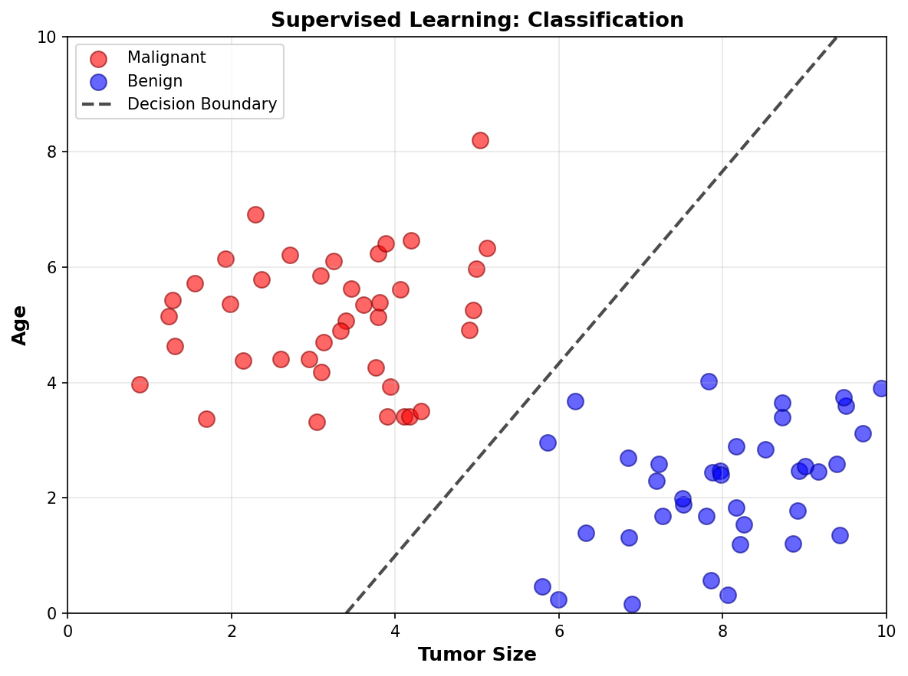

</div>

<!-- IMAGE PLACEHOLDER: fig/diagrams/01_supervised_learning_scatter.png
     Description: 2D scatter plot (X-axis=Size, Y-axis=Age) with red dots for malignant tumors,
     blue dots for benign tumors, with a clear decision boundary line separating the two classes. -->

---

## Unsupervised Learning

- **Training Set** without labels: $\{x_1^{(1)}, x_2^{(1)}, \ldots, x_1^{(n)}, x_2^{(n)}\}$
- **Objective**: Find hidden patterns or structure
- **Example**: Patient segmentation by tumor size and age
  - No predefined classes
  - Discover natural groupings

---

## Unsupervised Learning


<div class="center">

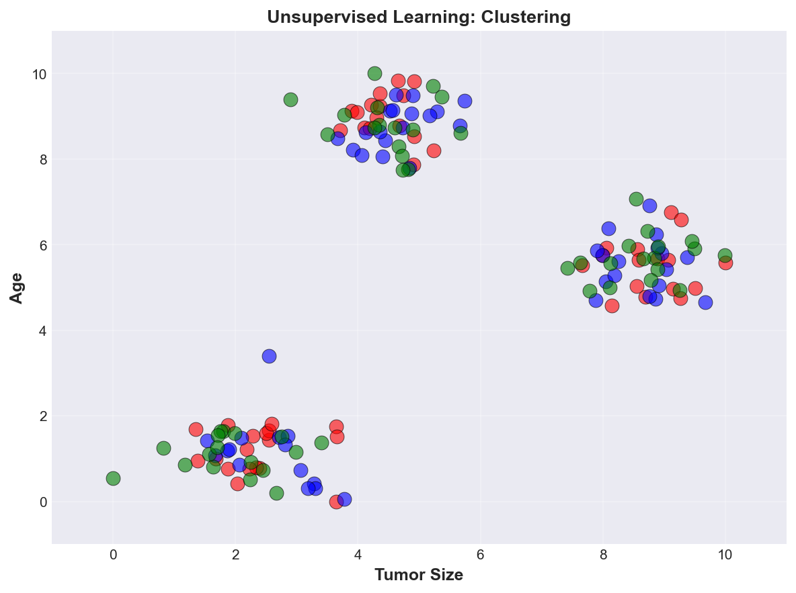

<!-- IMAGE PLACEHOLDER: fig/diagrams/01_unsupervised_learning_scatter.png
     Description: Same 2D scatter plot (X-axis=Size, Y-axis=Age) without labels and without decision boundary.
     Show natural groupings with different colored points representing discovered clusters. -->

---

<!-- _class: divider -->

## 02
## Clustering Applications

Real-world use cases

---

### Example 1: Market Segmentation & Social Networks

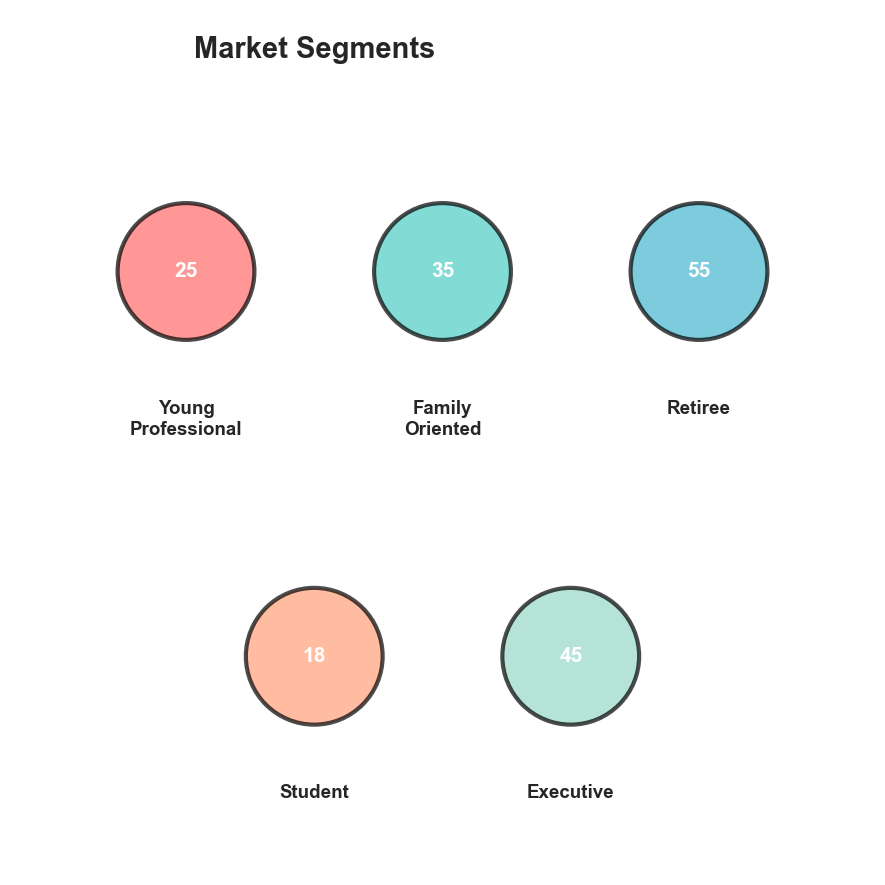

- **Market Segmentation**
  - Group customers by behavior and characteristics
  - Target marketing by segment

- **Social Network Analysis**
  - Identify communities within networks
  - Find groups of connected users

<!-- IMAGE PLACEHOLDER: fig/diagrams/02_market_segmentation.png
     Description: 3-4 customer personas visualized as colored profiles/avatars showing different ages,
     shopping behaviors, and preferences grouped together. -->

---

### Major Clustering Approaches

- **Partitioning** — Construct and evaluate various partitions: Example: K-Means

- **Hierarchical** — Build hierarchical decomposition: Agglomerative or Divisive

- **Model-Based** — Hypothesize model for each cluster: Gaussian Mixture Models

- **Density-Based** — Use connectivity and density functions: Example: DBSCAN
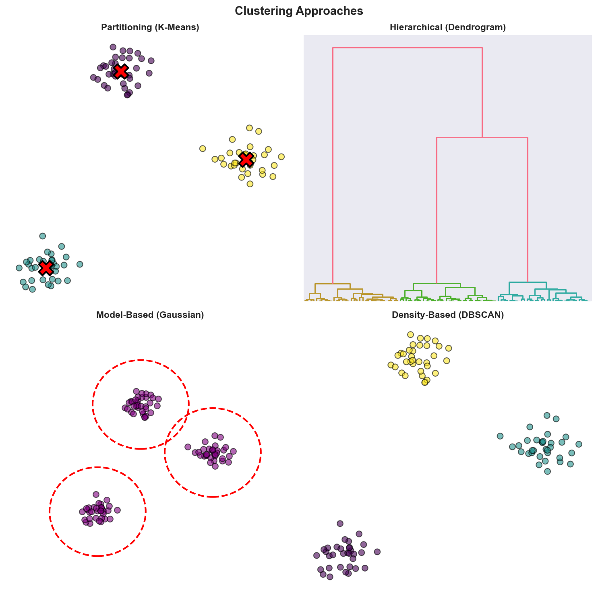

<!-- IMAGE PLACEHOLDER: fig/diagrams/02_clustering_approaches_grid.png
     Description: 2x2 grid showing 4 example outputs: (1) Partitioning=K spherical clusters,
     (2) Hierarchical=dendrogram tree, (3) Model-Based=Gaussian blobs, (4) Density-Based=irregular shapes with outliers. -->

---

<!-- _class: divider -->

## 03
## K-Means Algorithm

Partitioning-based clustering

---

## K-Means Algorithm

**Steps:**
1. Randomly initialize K cluster centroids: $\mu_1, \mu_2, \ldots, \mu_K \in \mathbb{R}^n$
2. **Repeat:**
   - **Assign:** For each point i, assign to nearest centroid
     - $c^{(i)}$ := index of closest centroid
   - **Update:** Recalculate centroids
     - $\mu_k$ := mean of points assigned to cluster k

---

## K-Means Algorithm Visualization

- Iteratively refines cluster assignments
- Points move between clusters until convergence
- Each iteration reduces within-cluster distance
- Visual representation shows:
  - Initial random centroids
  - Progressive cluster formation
  - Final stable clustering

---

## K-Means Algorithm Visualization


<div class="center">

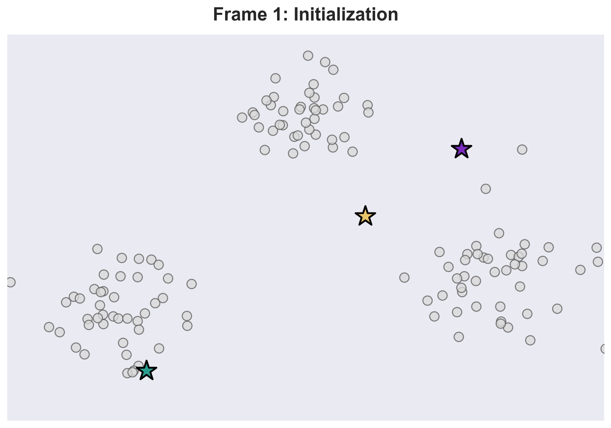
</div>

---

## K-Means Algorithm Visualization


<div class="center">

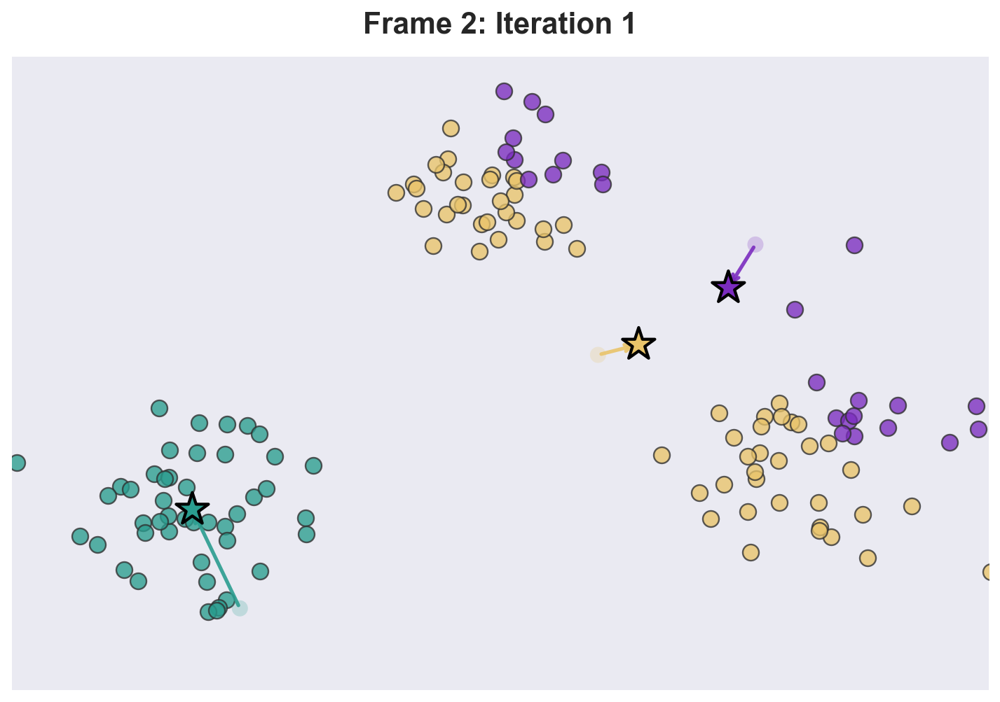
</div>

---

## K-Means Algorithm Visualization


<div class="center">

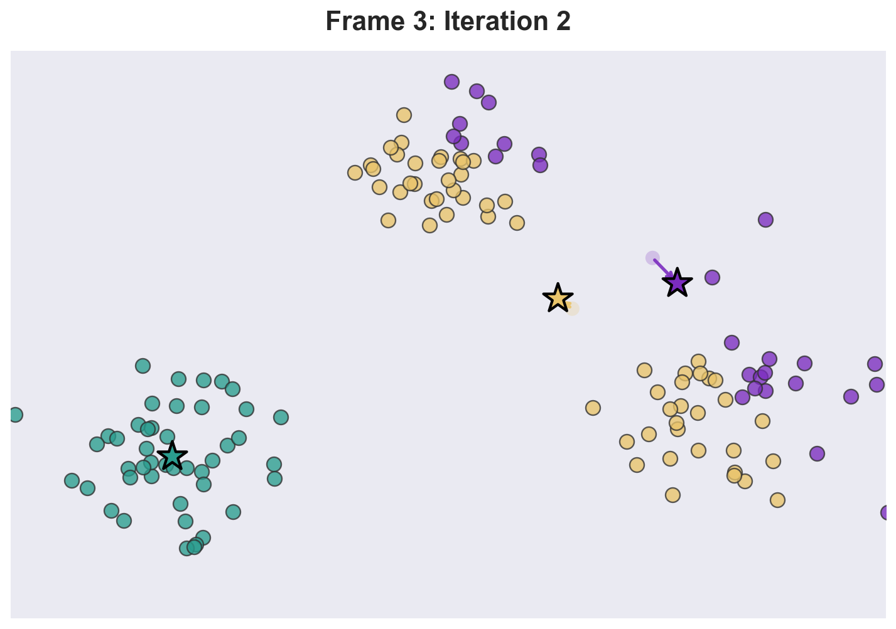
</div>

---

## K-Means Algorithm Visualization


<div class="center">

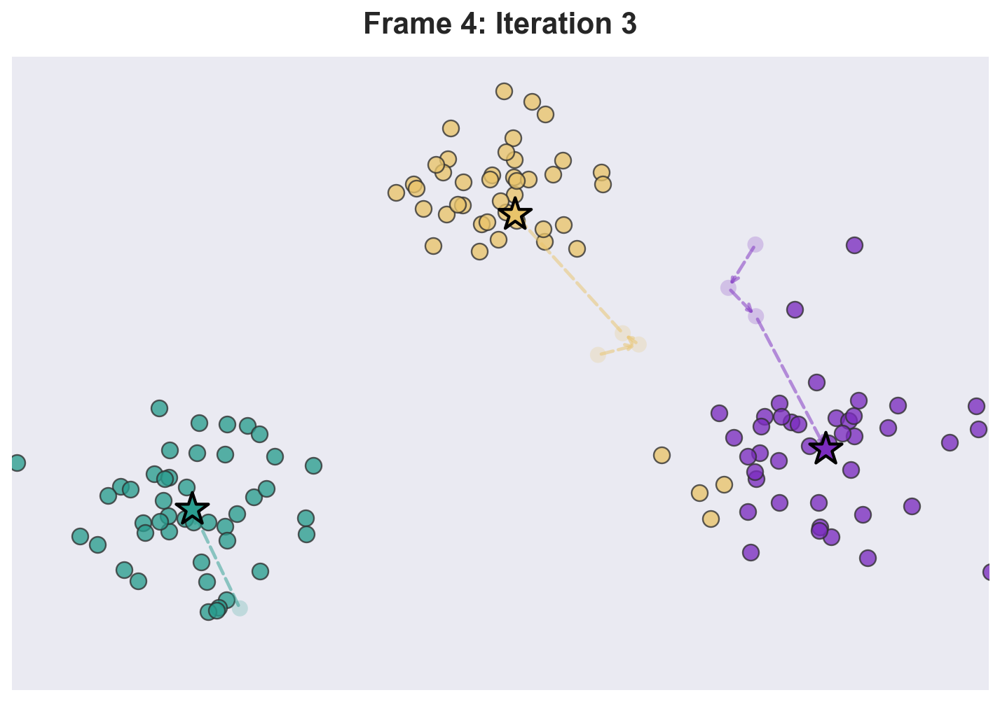

</div>

<!-- IMAGE PLACEHOLDER: fig/diagrams/03_kmeans_iterations_4frame.png
     Description: 4-frame sequence showing: (1) Random initialization with scattered dots and 3 red × centroids,
     (2) After iteration 1 with colored clusters, (3) After iteration 2, (4) Final convergence with 3 stable clusters. -->

---

## K-Means for Non-Separated Clusters

- Works best when clusters are well-separated
- Struggles with overlapping or non-spherical shapes
- Assumes equal cluster sizes
- May produce unintuitive results with irregular data


---

## K-Means for Non-Separated Clusters

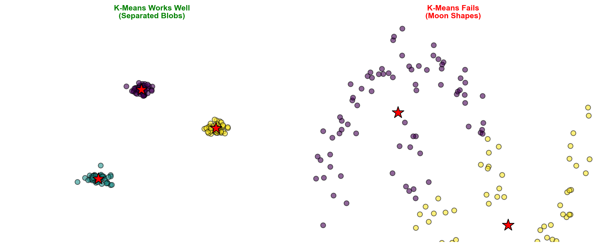

<!-- IMAGE PLACEHOLDER: fig/diagrams/03_kmeans_limitations_comparison.png
     Description: Side-by-side comparison: (Left) Well-separated spherical clusters with K-Means success,
     (Right) Moon/crescent-shaped dataset showing K-Means failure with overlapping cluster boundaries. -->

---

## Optimization Objective

**Cost Function (Distortion):**
$$J(c^{(1)}, \ldots, c^{(m)}, \mu_1, \ldots, \mu_K) = \frac{1}{m} \sum_{i=1}^{m} \|x^{(i)} - \mu_{c^{(i)}}\|^2$$

**Goal:** Minimize cost function
$$\min_{c^{(1)},\ldots,c^{(m)}, \mu_1,\ldots,\mu_K} J(c^{(1)}, \ldots, c^{(m)}, \mu_1, \ldots, \mu_K)$$

- Each iteration decreases or maintains the cost
- Algorithm converges to local optimum


---

### Optimization Objective

<div class="center">

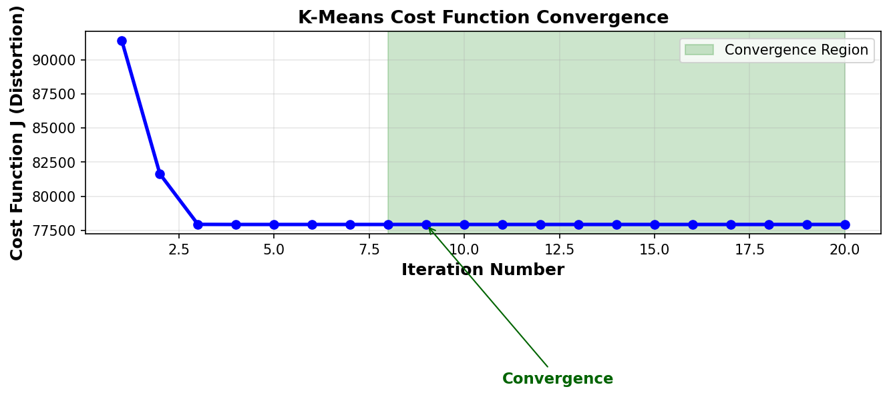

</div>

<!-- IMAGE PLACEHOLDER: fig/diagrams/03_cost_function_curve.png
     Description: Line graph with X-axis=Iteration number (0-20), Y-axis=Cost J. Show decreasing curve that
     plateaus, with annotation marking the plateau region as "convergence". -->

---

## Random Initialization

**Recommended approach:**
- Should have K < m (fewer clusters than points)
- Randomly pick K training examples
- Set centroids $\mu_1, \ldots, \mu_K$ equal to these examples

**Why this matters:**
- Leads to better convergence
- More likely to find good clusters
- Ensures initial centroids are within data range

---

## Local Optima Problem

- K-Means can converge to different local optima
- Different initializations may yield different results
- Same data can produce different clusterings

**Solution:**
- Run K-Means multiple times (e.g., 50-100 times)
- For each run: compute cost function J
- Select clustering with **lowest cost**

---

## Local Optima Problem


<div class="center">

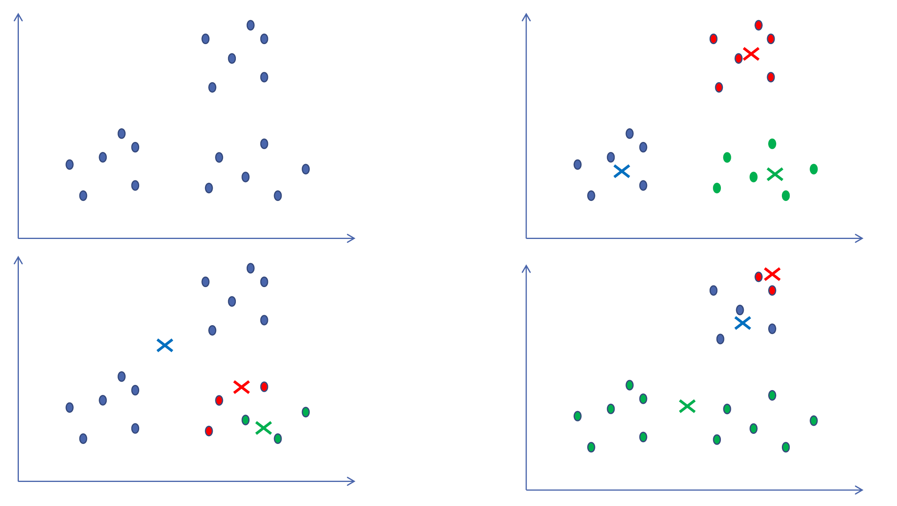


---

## Choosing the Number of Clusters

- Often problem-dependent
- No universally optimal K
- Two main approaches:
  - **Elbow Method** — Look for "elbow" in cost curve
  - **Silhouette Analysis** — Measure cluster quality
  - **Domain Knowledge** — Use application requirements

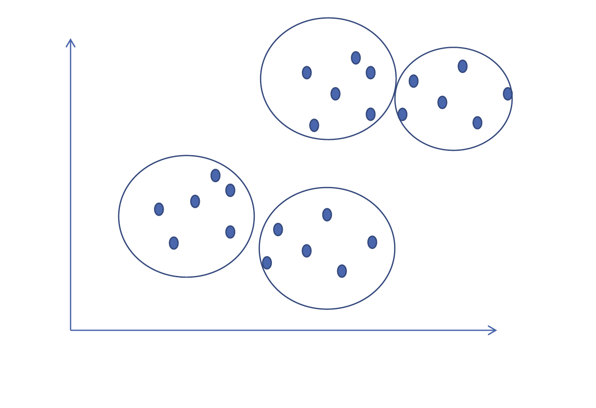

---

## Elbow Method

- Plot cost function J vs. number of clusters K
- Cost decreases as K increases
- Look for "elbow" point where decrease slows
- Choose K at the elbow

**Challenge:**
- Elbow often ambiguous or absent
- Works better in some datasets than others


---

## Elbow Method

<div class="center">

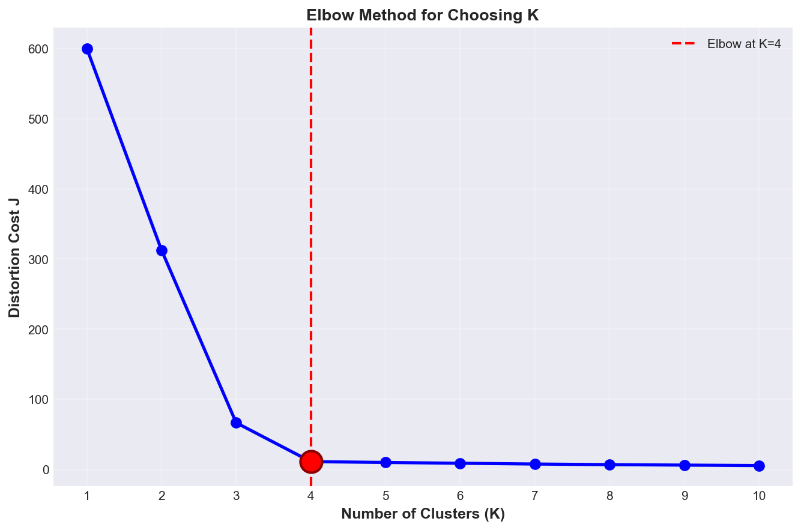

</div>

<!-- IMAGE PLACEHOLDER: fig/diagrams/03_elbow_method_curve.png
     Description: Line graph with X-axis=Number of clusters K (1-10), Y-axis=Distortion cost J.
     Show rapid decrease initially, then plateauing, with a clear "elbow" marked at K=3 or K=4. -->

---
## Silhouette Analysis

- Measures how similar a point is to its own cluster vs. other clusters
- Silhouette score s(i) for point i:
$$s(i) = \frac{b(i) - a(i)}{\max(a(i), b(i))}$$
  - a(i) = average distance to points in same cluster
  - b(i) = average distance to points in nearest cluster
- Score ranges from -1 to 1
  - s(i) close to 1 → well-clustered
  - s(i) close to 0 → on cluster boundary
  - s(i) close to -1 → possibly assigned to wrong cluster   
- Average silhouette score across all points indicates overall clustering quality

---

## Practical Example: T-Shirt Sizing

- **K=3:** Small, Medium, Large
- **K=4:** XS, Small, Medium, Large, Extra Large
- Choose based on:
  - Business requirements
  - Market segmentation needs
  - Supply chain constraints

---

## Practical Example: T-Shirt Sizing

<div class="center">

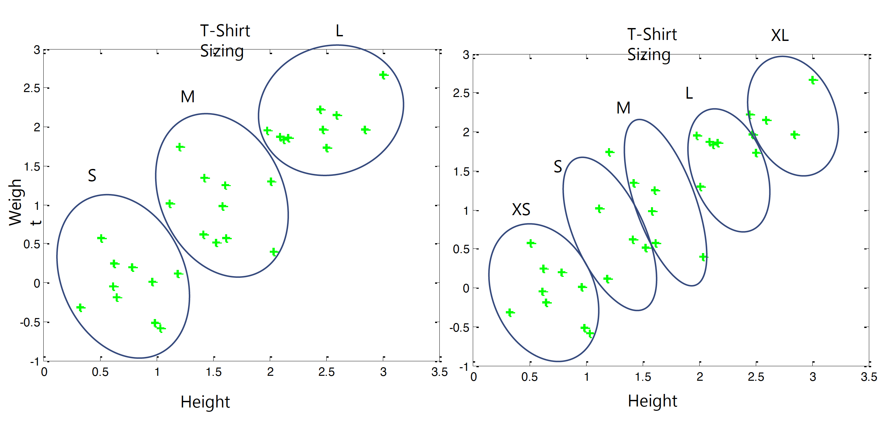

<!-- IMAGE PLACEHOLDER: fig/diagrams/03_tshirt_sizing_distribution.png
     Description: Histogram/scatter plot showing customer heights/sizes with K=3 showing 3 overlapping regions
     for S/M/L and separate subplot showing K=4 with 5 regions for XS/S/M/L/XL. -->

---

## Practical Example: T-Shirt Sizing

<div class="center">

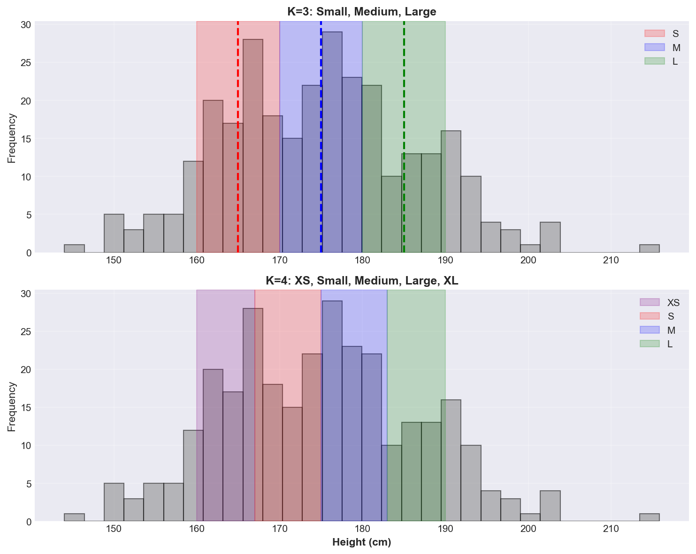

---

## Lab: K-Means Clustering

https://github.com/toche7/DSEssentials/blob/main/Lab8_KMean_STD.ipynb


---

<!-- _class: divider -->

## 04
## Density-Based Clustering

DBSCAN approach

---

## Why Density-Based Clustering?

**K-Means Limitations:**
- Produces spherical clusters of similar size
- Struggles with arbitrary shapes
- Cannot handle varying densities well

**DBSCAN Advantages:**
- Discovers arbitrary-shaped clusters
- Handles clusters of different densities
- Identifies noise/outlier points
- No need to specify number of clusters

---

## Why Density-Based Clustering?

<div class="center">

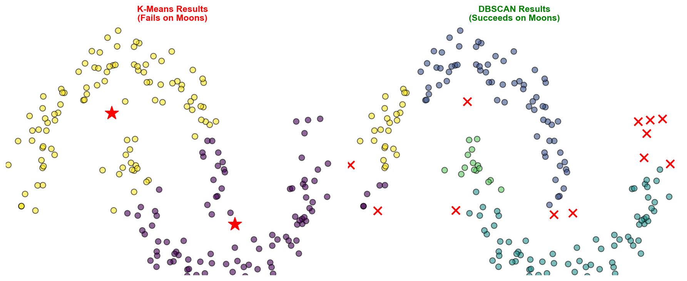

<!-- IMAGE PLACEHOLDER: fig/diagrams/04_kmeans_vs_dbscan_comparison.png
     Description: Split-screen comparison on a crescent moon dataset: (Left) K-Means result showing
     bad spherical clusters; (Right) DBSCAN result correctly identifying the two crescent shapes. -->

---

## DBSCAN Algorithm

**Name:** Density-Based Spatial Clustering of Applications with Noise (Ester et al., 1996)

**Basic Idea:**
- Group points in high-density regions
- Mark isolated points as outliers
- Builds clusters by density connectivity

**Key Parameters:**
- ε (epsilon): neighborhood radius
- MinPts: minimum points in neighborhood

---

## Definitions: Epsilon-Neighborhood

**$\varepsilon$-neighborhood of point p:**
$$N_\varepsilon(p) = \{q \in D \mid \text{dist}(p, q) \leq \varepsilon\}$$

- All points within distance $\varepsilon$ from p

**High Density Condition:**
- A point has **high density** if its $\varepsilon$-neighborhood contains at least MinPts points

---

## Point Classification in DBSCAN

<div class="center">

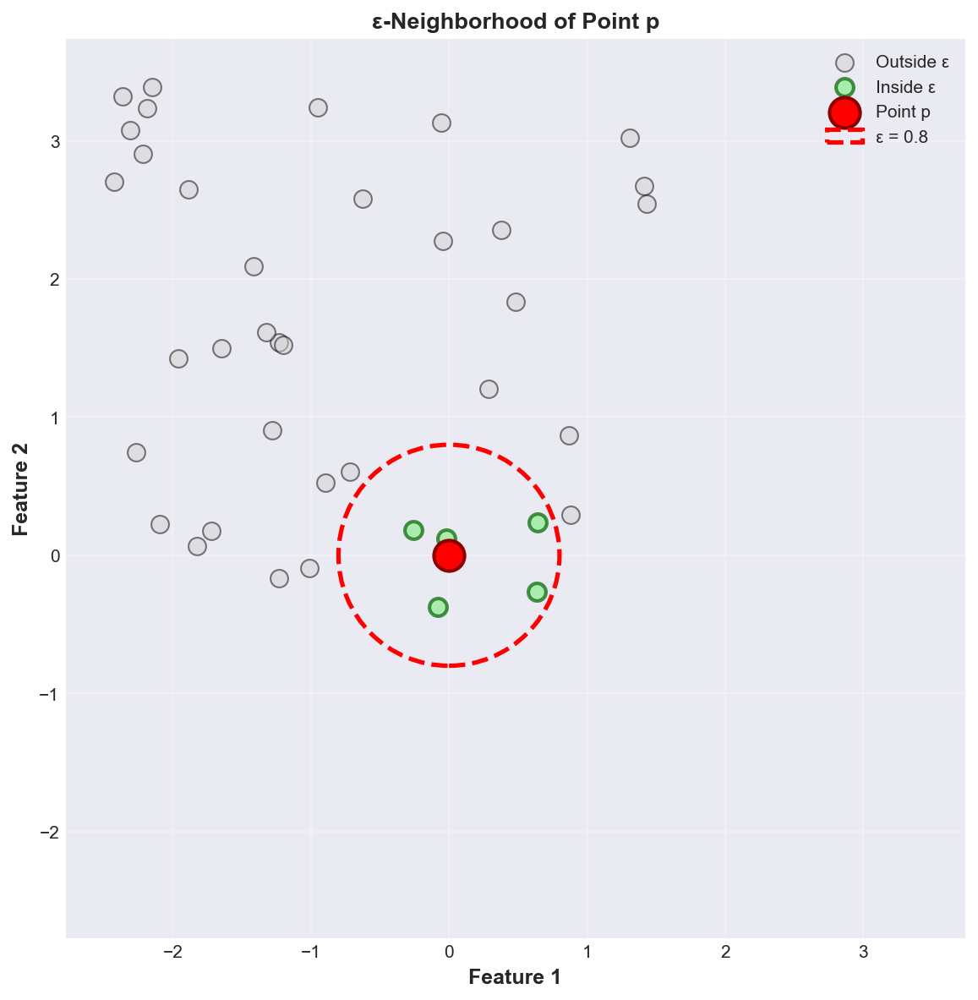

<!-- IMAGE PLACEHOLDER: fig/diagrams/04_epsilon_neighborhood_circle.png
     Description: Scatter plot with point p in center surrounded by a circle of radius ε.
     Show 5-6 query points q inside the circle highlighted in green and a few outside grayed out. -->

---

## Point Classification in DBSCAN

Three categories:
- **Core Point** — $\varepsilon$-neighborhood contains $\geq$ MinPts points
- **Border Point** — Not core, but within $\varepsilon$-neighborhood of a core point
- **Noise Point** — Neither core nor border point

---

## Point Classification in DBSCAN

<div class="center">

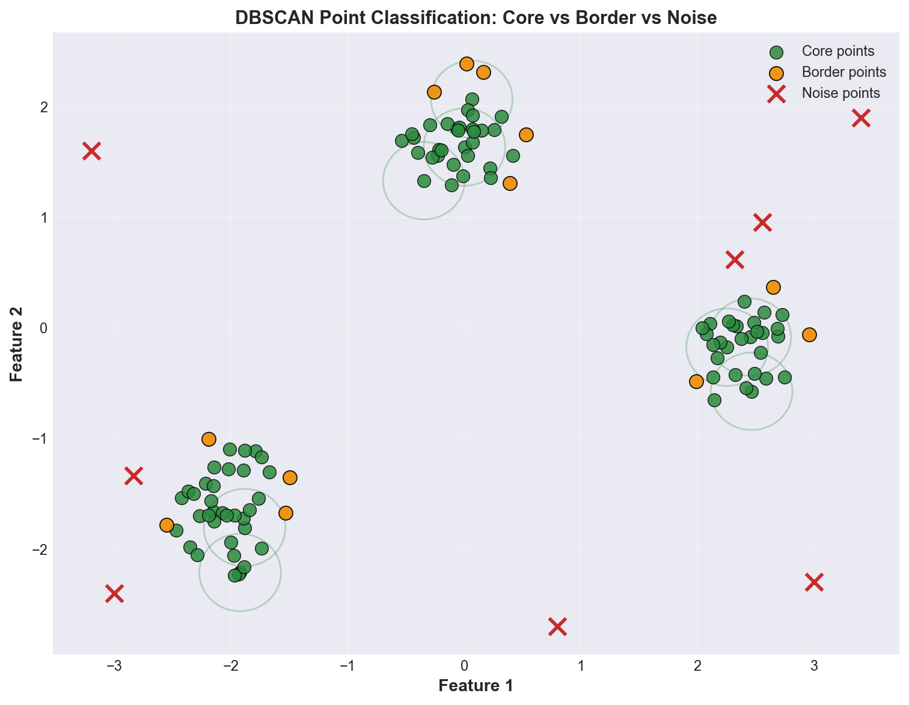

<!-- IMAGE PLACEHOLDER: fig/diagrams/04_point_classification_diagram.png
     Description: Scatter plot showing three types of points: Core points (solid colored circles with ε-neighborhoods),
     Border points (on edge of core neighborhoods), Noise points (isolated, marked with × symbols). Color-code appropriately. -->

---

## Definitions: Density-Reachability

**Directly Density-Reachable:**
- Point p is directly density-reachable from q if:
  - q is a core point: $|N_\varepsilon(q)| \geq \text{MinPts}$
  - p belongs to $N_\varepsilon(q)$
- Note: Relationship is **asymmetric**

<div class="center">

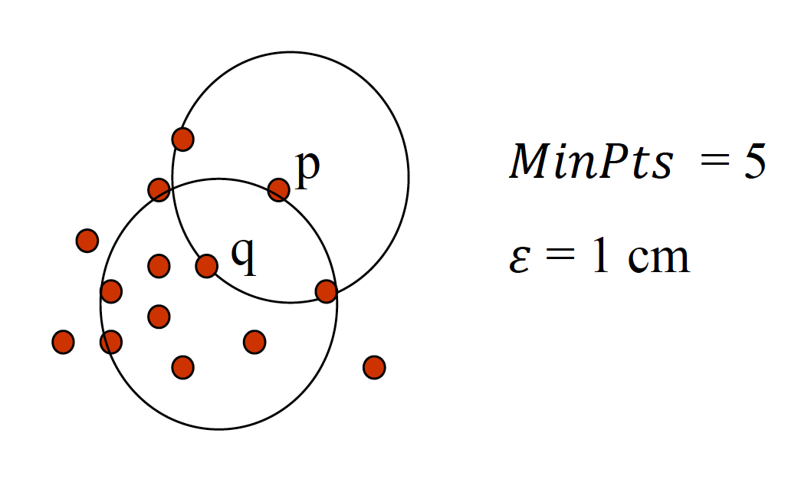


---

### Definitions: 

**Density-Reachable (chain):**
- p is density-reachable from q if chain of points $p_1, \ldots, p_n$ exists where:
  - $p_1 = q, p_n = p$
  - $p_{i+1}$ directly density-reachable from $p_i$


**Density-Connected Points:**
- Points p and q are density-connected if:
  - There exists point o such that
  - Both p and q are density-reachable from o

**Property:** Symmetric relationship

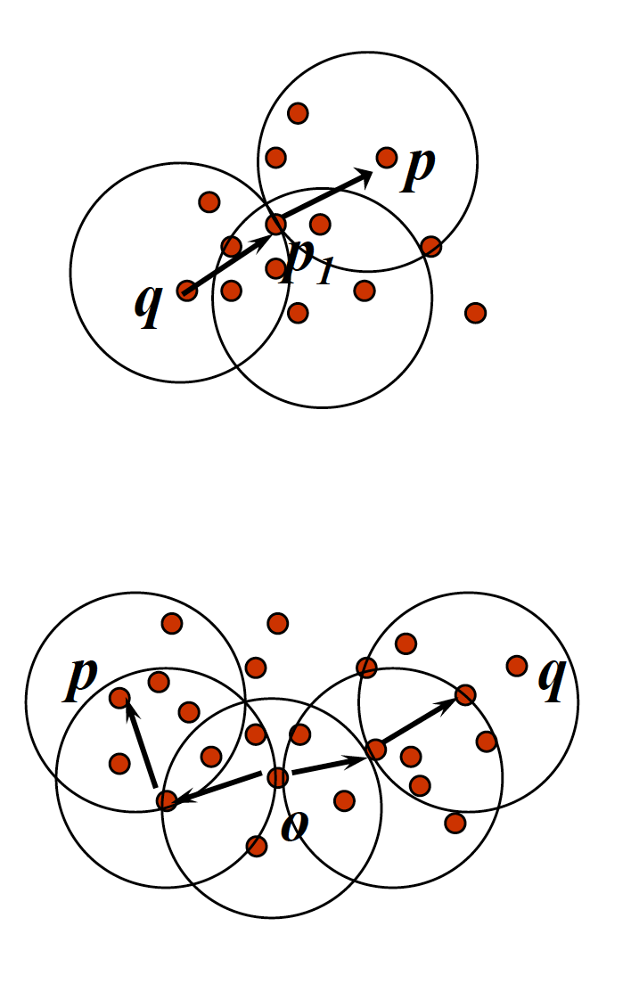


---

## Formal Description of Cluster

**Given:** Dataset D, parameters ε and MinPts

**Cluster C is a subset of D satisfying:**
- **Maximality:** If p ∈ C and q is density-reachable from p, then q ∈ C
- **Connectivity:** All pairs p, q ∈ C are density-connected

**Note:** Clusters contain both core points and border points

---

## DBSCAN Algorithm

```
for each point p in D do
  if p is not yet classified then
    if p is a core-point then
      collect all points density-reachable from p
      assign them to a new cluster
    else
      assign p to NOISE
```

---

## DBSCAN Examples

**Comparison with K-Means:**
- K-Means: Produces spherical clusters, requires specified K
- DBSCAN: 
  - Discovers arbitrary cluster shapes
  - Automatically identifies outliers
  - No need to specify K


---

## DBSCAN Examples

<div class="center">

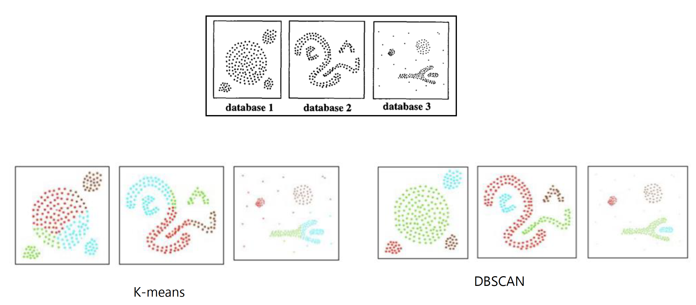

<!-- IMAGE PLACEHOLDER: fig/diagrams/04_DBscanExample.png
     Description: 3-4 example datasets in a grid showing: (1) Concentric circles (K-Means fails vs DBSCAN succeeds),
     (2) Moons dataset, (3) Blobs with noise points, (4) Varying density clusters. Show side-by-side results. -->

---

## DBSCAN: Parameter Selection

<div class="columns">
<div>

**Large ε:**
- Many points become core/border points
- Fewer noise points
- Clusters merge together
</div>
<div>

**Small ε:**
- Fewer core/border points
- More noise points
- Clusters fragment
</div>
<div>

**Optimal ε:**
- Discovered through experimentation
- Visual inspection of results
- Domain knowledge
</div>
</div>

---

## DBSCAN: Large ε

<div class="center">

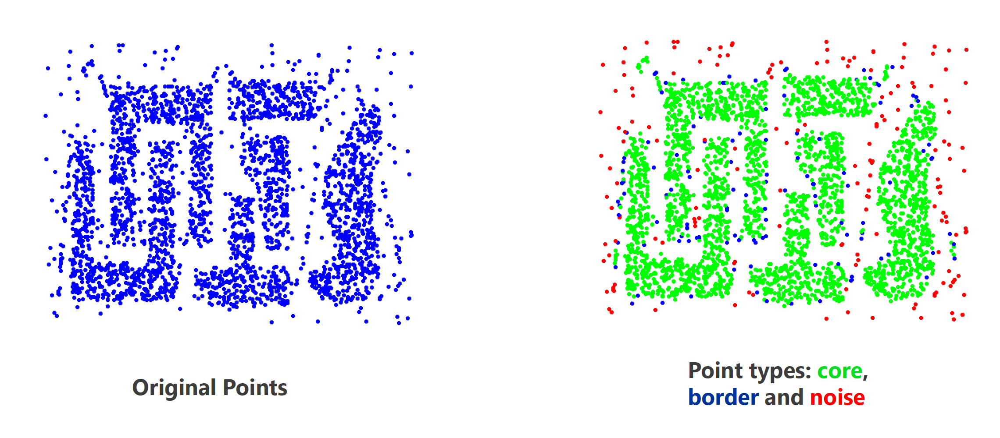 

<!-- IMAGE PLACEHOLDER: fig/diagrams/04_epsilon_parameter_effects_3plots.png
     Description: 3 scatter plots of same dataset showing: (1) Large ε = few merged clusters,
     (2) Small ε = fragmented clusters with many noise points (×), (3) Optimal ε = well-balanced clustering. -->

---

## DBSCAN: Optimal ε Selection

<div class="center">

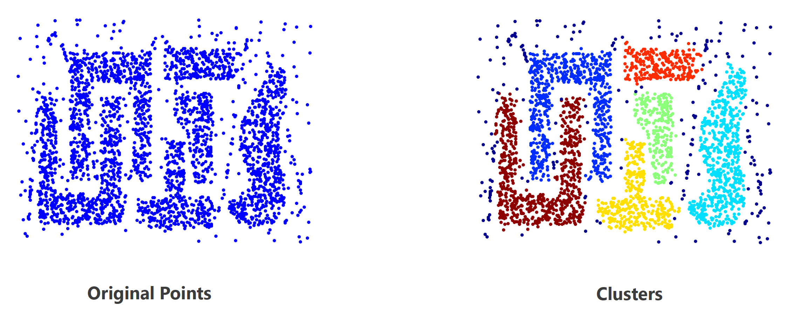

---

## DBSCAN: Advantages & Limitations

<div class="columns">
<div>

**Advantages:**
- Arbitrary cluster shapes
- Handles varying densities (with parameter tuning)
- Identifies outliers
- Automatic cluster count

</div>
<div>

**Limitations:**
- Sensitive to parameters ε and MinPts
- Struggles with varying density clusters
- High computational cost for large datasets
- Performance degrades in high dimensions
  
</div>
</div>

---

## DBSCAN: Flaw Example

<div class="center">

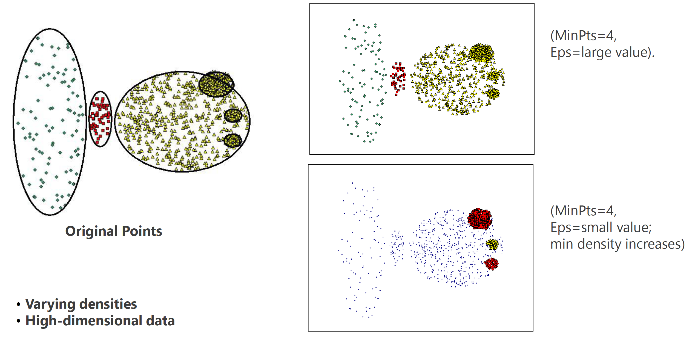


---

## Lab: DBSCAN Clustering

[](https://colab.research.google.com/github/toche7/SlideDataSci/blob/main/DBSCAN_colab.ipynb)


---

<!-- _class: divider -->

## 05
## Hierarchical Clustering

Building tree-based cluster hierarchies

---

## Hierarchical Clustering Overview

**Definition:** Builds a tree (dendrogram) of clusters from bottom-up or top-down

**Two Main Approaches:**
- **Agglomerative (Bottom-up)** — Start with individual points, merge into clusters
  - Most common approach
  - Intuitive and flexible
  
- **Divisive (Top-down)** — Start with one cluster, recursively split
  - Less commonly used
  - Computationally more expensive


---

## Hierarchical Clustering 

<div class="center">

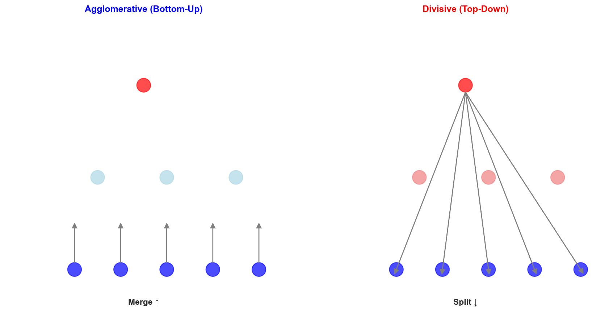

<!-- IMAGE PLACEHOLDER: fig/diagrams/05_agglomerative_vs_divisive_trees.png
     Description: Two tree diagrams side-by-side: (Left) Agglomerative showing 5 individual nodes at bottom
     merging upward to a root. (Right) Divisive showing 1 node at top splitting downward to 5 nodes at bottom. -->

---

## Agglomerative Hierarchical Clustering

**Algorithm Steps:**
1. Start with each point as its own cluster: n clusters
2. **Repeat until one cluster remains:**
   - Find two closest clusters
   - Merge them into a single cluster
   - Decrement cluster count

**Result:** Dendrogram showing hierarchical merge sequence


---

## Agglomerative Hierarchical Clustering

<div class="center">

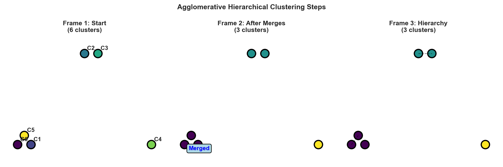

<!-- IMAGE PLACEHOLDER: fig/diagrams/05_agglomerative_steps_3frames.png
     Description: 3-step visualization: (1) Start with 6 individual points as separate clusters,
     (2) After iteration 1 showing 2 closest pairs merged, (3) Final result showing nested cluster structure. -->

---

## Linkage Criteria


- **Single Linkage** — Distance between closest pair of points
  - Prone to "chaining" effect
  
- **Complete Linkage** — Distance between farthest pair of points
  - Tends to create compact clusters
  
- **Average Linkage** — Average distance between all pairs
  - Balanced approach
  
- **Ward Linkage** — Minimizes within-cluster variance
  - Similar to K-Means objective

---

## Linkage Criteria

<div class="center">

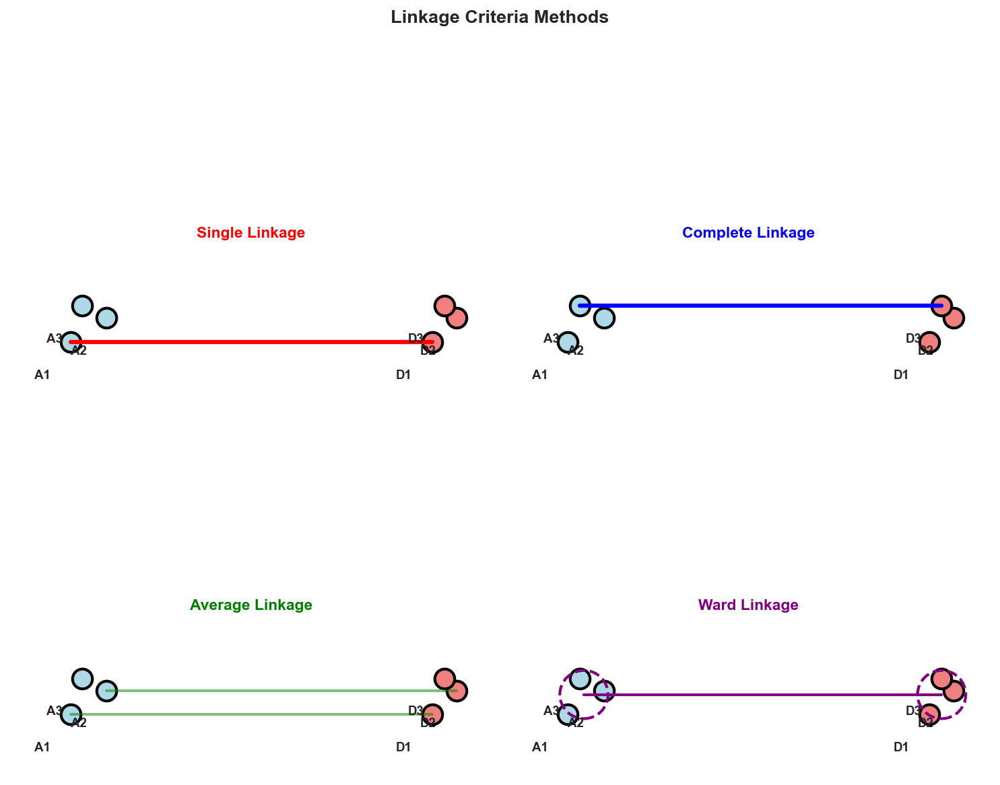

<!-- IMAGE PLACEHOLDER: fig/diagrams/05_linkage_criteria_4methods.png
     Description: 4 side-by-side diagrams showing two clusters {A,B,C} and {D,E,F} with lines indicating:
     (1) Single linkage (closest pair), (2) Complete linkage (farthest pair), (3) Average linkage (all pairs avg),
     (4) Ward linkage (variance minimization). Color-code distance lines differently. -->

---

## Single vs. Complete Linkage

**Single Linkage:**
- Merges clusters based on closest neighbors
- Can create long, chain-like clusters
- Less robust to outliers spreading clusters

**Complete Linkage:**
- Merges clusters based on farthest neighbors
- Creates more spherical, compact clusters
- More conservative merging strategy


---

## Single vs. Complete Linkage

<div class="center">

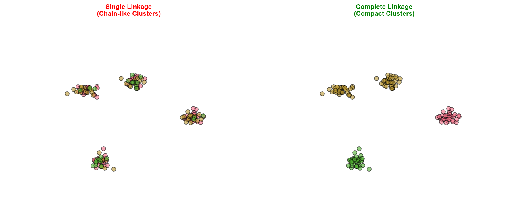

<!-- IMAGE PLACEHOLDER: fig/diagrams/05_single_vs_complete_results.png
     Description: Split-screen showing same dataset clustered two ways: (Left) Single linkage result showing
     chain-like/elongated clusters; (Right) Complete linkage result showing compact, spherical clusters. -->

---

## Dendrograms

**Visual Representation:**
- Horizontal axis: Individual data points
- Vertical axis: Distance at which clusters merge
- Height of merge point indicates cluster distance

**Reading Dendrograms:**
- Cut at different heights gives different clusterings
- Lower cut → more clusters
- Higher cut → fewer clusters
- No predetermined number of clusters needed

---

## Dendrograms

<div class="center">

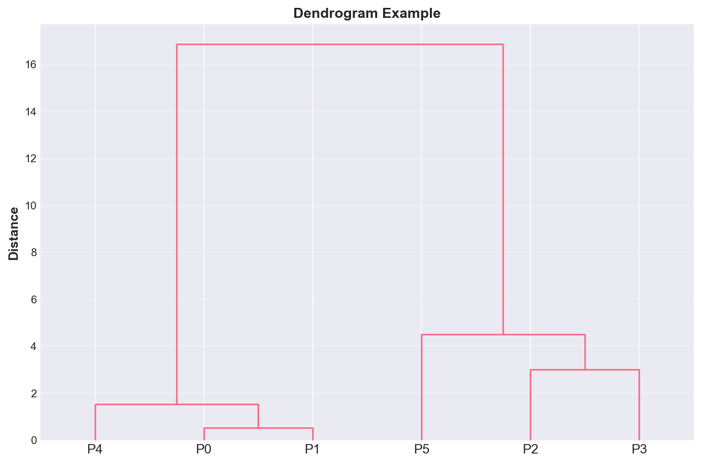

<!-- IMAGE PLACEHOLDER: fig/diagrams/05_dendrogram_example.png
     Description: Sample dendrogram with 8-10 point labels on horizontal axis, vertical axis showing merge heights.
     Draw tree structure showing hierarchical relationships with clear merge points at different heights. -->

---

## Dendrogram Example

**Interpretation:**
- Distance threshold determines final clusters
- Can extract clustering at any height
- Flexible cluster count selection
- Provides full hierarchical view of data structure

**Advantages of visualizing:**
- Understand data relationships
- Identify natural groupings
- Detect outliers and anomalies

---

## Dendrogram Example

<div class="center">

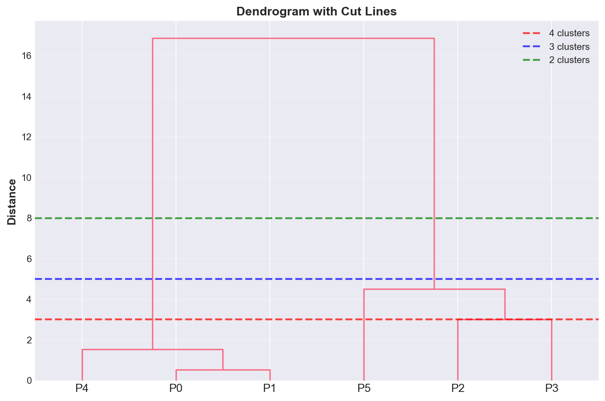

<!-- IMAGE PLACEHOLDER: fig/diagrams/05_dendrogram_with_cutlines.png
     Description: Same dendrogram with multiple horizontal dotted cut lines at different heights,
     each labeled showing resulting cluster count (e.g., "4 clusters", "3 clusters", "2 clusters"). -->

---

## Hierarchical vs. Flat Clustering

**Hierarchical (Agglomerative):**
- Produces dendrogram
- Flexible cluster count
- Deterministic (no randomness)
- More interpretable structure

**Flat (K-Means):**
- Produces fixed K clusters
- Faster computation
- May need multiple runs
- More sensitive to initialization

---

## Hierarchical vs. Flat Clustering

<div class="center">

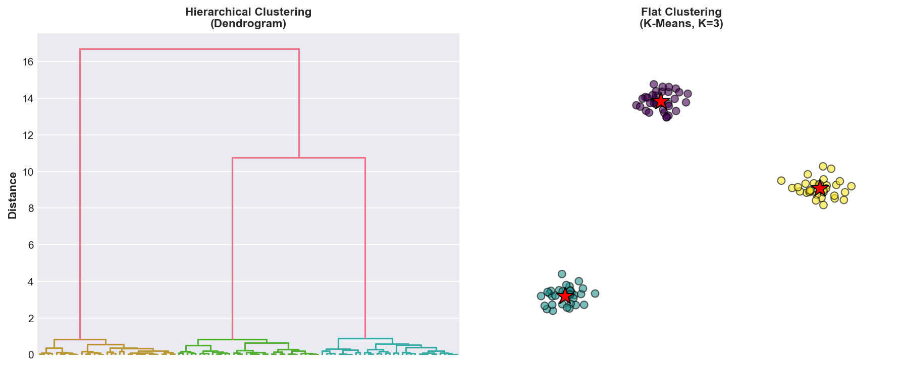

<!-- IMAGE PLACEHOLDER: fig/diagrams/05_hierarchical_vs_flat_comparison.png
     Description: Split-screen comparison on same dataset: (Left) Dendrogram showing tree structure with
     hierarchical relationships; (Right) K-Means result showing flat clusters with fixed K=3 coloring. -->

---

## Computational Complexity

**Agglomerative Hierarchical:**
- Time complexity: O(n³) with simple linkage
- O(n² log n) with better implementation
- Space complexity: O(n²) for distance matrix

**Comparison:**
- K-Means: O(n · K · i · d) where i = iterations
- Hierarchical: Better for understanding structure
- K-Means: Better for large datasets

---

## Advantages of Hierarchical Clustering

- **No need to specify K** — Choose any height
- **Dendrograms** — Visual interpretation of relationships
- **Deterministic** — Same result every run
- **Flexible** — Different linkage criteria available
- **Interpretability** — Clear hierarchical structure

---
## Lab : Hierarchical Clustering

[](https://colab.research.google.com/github/toche7/SlideDataSci/blob/main/Hierarchical_Clustering_colab.ipynb)

---

## Disadvantages of Hierarchical Clustering

- **Computational Cost** — O(n²) or O(n³) complexity
- **No Reversibility** — Cannot undo merges once made
- **Sensitive to Noise** — Outliers can distort merges
- **Different Linkage** — Results vary with linkage choice
- **Large Datasets** — Impractical for very large n

---

## When to Use Hierarchical Clustering

<div class="columns">
<div>

**Good for:**
- Small to medium datasets (n < 10,000)
- Need to understand cluster relationships
- Exploratory data analysis
- Comparing different cluster solutions
- Domain needs interpretability
</div>
<div>

**Not ideal for:**
- Very large datasets
- When computational efficiency critical
- When only final clustering needed
- Real-time applications
</div>
</div>

---

## Clustering Methods Comparison

| Method | Speed | Interpretability | K Required | Shapes | Scalability |
|--------|-------|------------------|-----------|--------|-------------|
| K-Means | Fast | Moderate | Yes | Spherical | Excellent |
| Hierarchical | Slow | Excellent | No | Any | Poor |
| DBSCAN | Fast | Excellent | No | Any | Good |

---


## Key Takeaways

- K-Means: Fast, spherical clusters, requires K
- DBSCAN: Flexible shapes, no K needed, parameter tuning needed
- Hierarchical: Dendrograms, interpretable, but computationally expensive
- Choose based on:
  - Expected cluster shapes
  - Noise handling needs
  - Computational constraints

---

## Thank You

**Questions?**

Taweesak Samanchuen
