<!-- _class: lead -->

<style scoped>
img { position: absolute; top: 36px; right: 64px; width: 120px; height: 120px; object-fit: contain; }
</style>


# Dimensionality Reduction

<div class="subtitle">PCA | LDA | Random Projection | UMAP</div>


หลักสูตร: Mini-Data Science

Asst. Prof. Taweesak Samanchuen, Ph.D.
Mahidol University

---

## Learning outcomes

By the end of this module, participants can:

1. Explain why high-dimensional data is difficult to analyze
2. Distinguish feature selection from feature extraction
3. Apply PCA, LDA, Random Projection, and UMAP
4. Choose a method for a specific machine learning task
5. Interpret reduced representations responsibly

---

## Six-hour roadmap

| Time | Topic | Format |
|---|---|---|
| 09:00-09:30 | High-dimensional data | Lecture |
| 09:30-11:00 | Principal Component Analysis | Lecture + workshop |
| 11:00-12:00 | Linear Discriminant Analysis | Lecture + workshop |
| 13:00-13:45 | Random Projection | Lecture + workshop |
| 13:45-14:45 | UMAP for visualization | Lecture + workshop |
| 14:45-16:00 | Method selection and challenge | Discussion + workshop |

---

<!-- _class: divider -->

## 01
## High-Dimensional Data

Why more features can mean less usable information

---

## What is a dimension?

A **dimension** is one measurable feature used to describe an observation.

- A house: area, rooms, age, location scores
- A patient: laboratory values, symptoms, vital signs
- An image: one feature per pixel or embedding component
- A text document: one feature per term or embedding dimension

> More dimensions offer more detail, but they also create new statistical and computational problems.

---

## The curse of dimensionality

As dimensions increase, data occupies a vastly larger space.

| In low dimensions | In high dimensions |
|---|---|
| Points appear relatively dense | Points become sparse |
| Nearby points are meaningful | Distances become similar |
| Plots reveal structure | Direct visualization fails |
| Models need moderate data | Models need far more data |

---

## Distance concentration

In high dimensions, the nearest and farthest observations can become surprisingly similar.

$$
\frac{d_{\max} - d_{\min}}{d_{\min}} \rightarrow 0
$$

- Distance-based methods become less discriminative
- Nearest-neighbor intuition becomes unreliable
- Feature scaling becomes essential

> A distance is only useful when it can distinguish "near" from "far."

---

## Why reduce dimensions?

- Remove noise and redundant signals
- Make models faster and easier to store
- Reduce risk of overfitting
- Enable 2D or 3D exploration
- Produce compact features for downstream models

---

## Selection vs extraction

| Feature selection | Feature extraction |
|---|---|
| Keeps a subset of original features | Creates new features |
| Preserves original interpretation | Combines information |
| Example: select top 10 genes | Example: PCA components |
| Useful for explainability | Useful for compact representation |

---

## Workshop: inspect redundancy

**Dataset:** Breast Cancer Wisconsin

1. Load the dataset and inspect the number of features
2. Standardize numerical variables
3. Plot a correlation matrix
4. Identify strongly correlated feature groups
5. Discuss what information may be redundant

---

<!-- _class: divider -->

## 02
## Principal Component Analysis

Find directions that retain the most variation

---

## PCA in one sentence

PCA rotates the feature space to new, uncorrelated axes called **principal components**.

- Component 1 captures the greatest available variance
- Component 2 captures the next greatest variance
- Each later component is orthogonal to earlier components
- Keep only the components that carry useful information

---

## PCA as compression

PCA maps an observation from $n$ original features to $k$ components, where $k < n$.

$$
x \in \mathbb{R}^{n}
\quad\longrightarrow\quad
z \in \mathbb{R}^{k}
$$

- The compressed vector $z$ stores coordinates along the chosen directions
- Good directions retain the structure that varies most in the data
- Compression is lossy when $k < n$, so some reconstruction error is expected

> PCA chooses directions that minimize squared perpendicular projection error.

---

## PCA projection in action

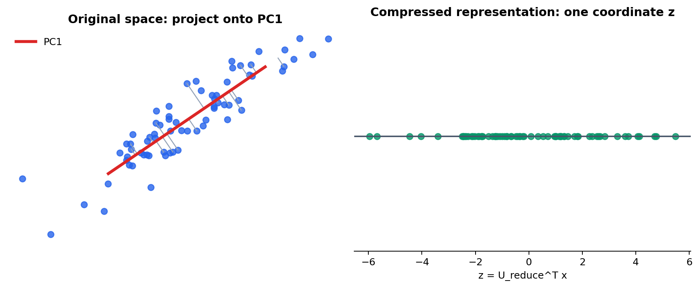

---

## PCA: map 3D to 2D

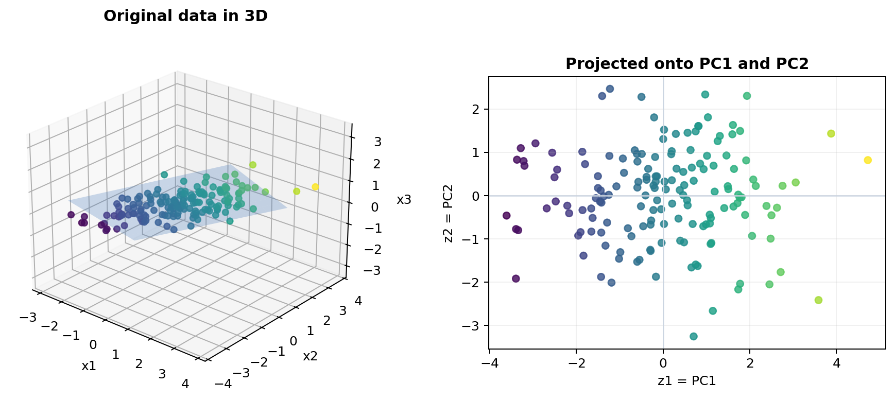

---

## PCA workflow

```text
Raw data
    v
Standardize features
    v
Covariance matrix
    v
Eigenvectors + eigenvalues
    v
Top k principal components
```

---

## PCA with SVD

After centering the training data, calculate the covariance matrix:

$$
\Sigma = \frac{1}{m} \sum_{i=1}^{m} x^{(i)} {x^{(i)}}^T
$$

Then use Singular Value Decomposition:

$$
\Sigma = U S V^T
$$

- Columns of $U$ are the principal directions
- Diagonal values in $S$ rank their importance
- Keep the first $k$ columns: $U_{\text{reduce}} = U[:, 1:k]$

---

## Why standardize first?

PCA is driven by variance. A large-scale feature can dominate the result even when it is not more important.

$$
z = \frac{x - \mu}{\sigma}
$$

- Standardization gives comparable numeric features equal opportunity
- Skip it only when units and scales are already deliberately comparable
- Fit the scaler on training data, then transform validation/test data

---

## Explained variance

The explained variance ratio ($\text{EVR}_i$) tells us how much variability each component retains.

$$
\text{EVR}_i = \frac{\lambda_i}{\sum_{j=1}^{p} \lambda_j}
$$

- $\text{EVR}_i$: proportion of total variance explained by component $i$
- $\lambda_i$: eigenvalue (variance) captured by principal component $i$
- $p$: number of original features, hence the total number of components
- $j$: index used to sum the variance across all $p$ components
- Use a scree plot to inspect diminishing returns
- Choose $k$ based on task needs, not a magic percentage
- A common starting target is 90-95% cumulative variance

---

## Reading a scree plot

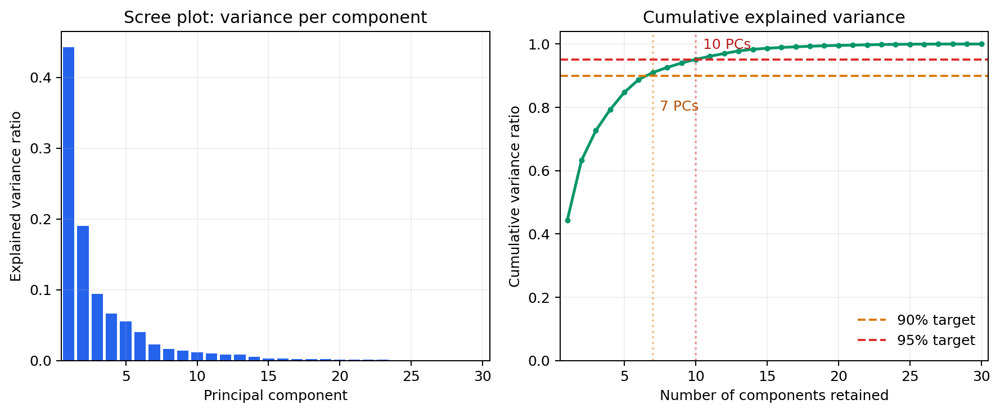

**Breast Cancer Wisconsin:** 7 components retain at least 90% variance; 10 components retain at least 95%.

---

## Choosing components

| Goal | Sensible choice |
|---|---|
| Visual exploration | 2 or 3 components |
| Compact preprocessing | Variance threshold or validation |
| Faster modeling | Test several values of $k$ |
| Reconstruction | Balance error against compression |

> A low reconstruction error does not guarantee the best predictive model.

---

## Choose k systematically

Select the smallest $k$ that reaches an explained-variance target:

$$
\frac{\sum_{i=1}^{k} \lambda_i}{\sum_{i=1}^{p} \lambda_i}
\geq \tau
$$

- $\tau = 0.90$, $0.95$, or $0.99$ can be a useful starting point
- Inspect the scree plot for an elbow or diminishing return
- Validate $k$ against the actual downstream metric
- A 2D plot is for understanding, not necessarily the best model input

---

## PCA workshop

**Breast Cancer dataset**

- Apply `StandardScaler` then `PCA()`
- Plot individual and cumulative explained variance
- Create a 2D projection colored by diagnosis
- Compare 20, 10, and 2 components
- Measure classification accuracy and runtime

[](https://colab.research.google.com/github/toche7/SlideDataSci/blob/main/Principal_Component_Analysis.ipynb)

---

## Reconstruction error

PCA can project data down and approximately reconstruct it back.

$$
\text{error} = \lVert X - \hat{X} \rVert^2
$$

- Small $k$: strong compression, more information loss
- Large $k$: less loss, less compression
- Inspect errors by observation to identify unusual cases

---

## Reconstruction: what is lost?

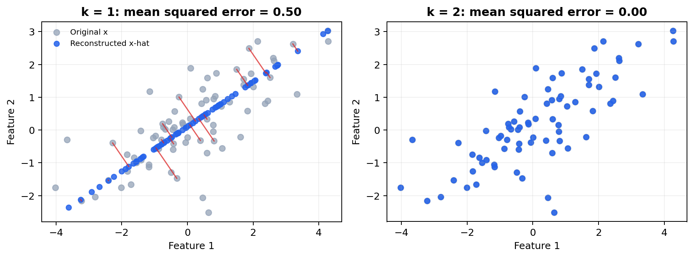

Red lines show the error $x - \hat{x}$ after compressing to one component.

---

## Project and reconstruct

For one centered observation $x$, project onto the retained components:

$$
z = U_{\text{reduce}}^T x
$$

Reconstruct an approximation in the original feature space:

$$
\hat{x} = U_{\text{reduce}} z
$$

- $z$ is the compact representation used for storage, plotting, or modeling
- $\hat{x}$ is useful for measuring what the compression lost
- Add the training mean back when reconstructing uncentered data

---

## From x to z and back

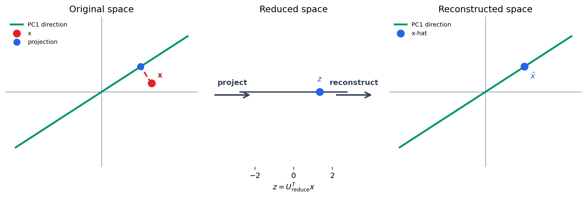

The red-to-blue gap is the information that one-component PCA cannot retain.

---

## Fit PCA on training data only

Treat scaling and PCA as learned transformations.

```text
Training set   -> fit scaler -> fit PCA -> train model
Validation set -> transform  -> transform -> evaluate
Test set       -> transform  -> transform -> final report
```

- Do not fit scaling or PCA using validation or test observations
- Put preprocessing and the estimator in one `Pipeline`
- Cross-validation must refit the complete pipeline inside each fold
- This avoids data leakage and overly optimistic scores

---

<!-- _class: divider -->

## 03
## Linear Discriminant Analysis

Reduce dimensions while separating known classes

---

## LDA is supervised

LDA uses class labels to find directions that make groups distinct.

- Maximize separation between class means
- Minimize spread within each class
- Requires a target label during fitting
- Produces at most $C - 1$ components for $C$ classes

---

## Fisher's criterion

LDA seeks a projection that maximizes:

$$
J(w) = \frac{w^T S_B w}{w^T S_W w}
$$


- $J(w)$: separation score for a candidate projection direction
- $w$: vector defining the one-dimensional direction used to project the data
- $S_B$: between-class scatter matrix, measuring separation among class means
- $S_W$: within-class scatter matrix, measuring spread inside each class
- $w^T$: transpose of $w$; the numerator and denominator are scalar quantities

> PCA asks "where is the variation?" LDA asks "where are the classes best separated?"

---

## Within- and between-class scatter

Let $\mu_c$ be the mean of class $c$, $\mu$ the overall mean, and $n_c$ the number of samples in class $c$.

$$
S_W = \sum_{c=1}^{C}\sum_{x \in c}(x - \mu_c)(x - \mu_c)^T
$$

$$
S_B = \sum_{c=1}^{C} n_c(\mu_c - \mu)(\mu_c - \mu)^T
$$

- $S_W$ measures how dispersed observations are within each class
- $S_B$ measures how far class centers are from the overall center

---

## Solving for LDA directions

The optimal directions are solutions to the generalized eigenvalue problem:

$$
S_B w = \lambda S_W w
$$

- Sort eigenvectors by descending eigenvalue $\lambda$
- Retain the first $k$ vectors in $W_k$ 
- Project each observation: $z = W_k^T x$
- The maximum useful dimension is $\min(p, C - 1)$ where $p$ is the number of features and $C$ is the number of classes

> With three Iris classes, LDA can produce at most two discriminant components.

---

## LDA: separate labeled groups

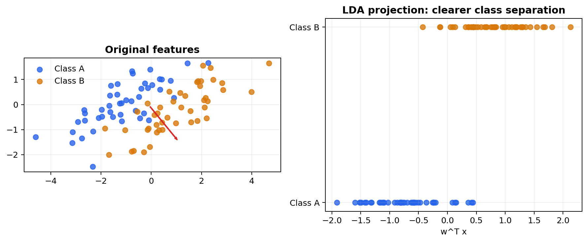

---

## Assumptions and numerical care

LDA is most stable when classes have roughly Gaussian distributions with similar covariance structures.

| Situation | Practical response |
|---|---|
| Features on very different scales | Standardize before fitting |
| Few samples, many features | Use `solver="lsqr"` with shrinkage or reduce features first |
| Strongly non-linear class boundary | Consider kernel methods or non-linear models |
| Unequal class frequencies | Inspect priors and class-balanced evaluation metrics |

> Scikit-learn's `LinearDiscriminantAnalysis` can be used both as a classifier and as a supervised dimensionality-reduction transformer.

---

## PCA versus LDA

| PCA | LDA |
|---|---|
| Unsupervised | Supervised |
| Preserves overall variance | Maximizes class separation |
| No labels needed | Labels required for fit |
| Up to feature-count components | Up to $C - 1$ components |
| General preprocessing | Classification-focused |

---

## LDA workshop

**Dataset:** Iris

1. Standardize the feature matrix
2. Project the data with PCA and LDA
3. Color each plot by species
4. Compare overlap and class separation
5. Test a classifier on the reduced features

[](https://colab.research.google.com/github/toche7/SlideDataSci/blob/main/Linear_Discriminant_Analysis.ipynb)

---

<!-- _class: divider -->

## 04
## Random Projection

Fast compression with controlled distance distortion

---

## The key idea

Random Projection maps data to a lower-dimensional space using a random matrix.

$$
X_{\text{reduced}} = XR
$$

- R is a random matrix with $k$ columns, where $k < n$
- No covariance decomposition is required
- The projection is fast for very wide data
- Distances are approximately preserved in expectation

---

## Johnson-Lindenstrauss intuition

For $n$ points, the target dimension can scale roughly with:

$$
k = O\left(\frac{\log n}{\varepsilon^2}\right)
$$

- $O$ notation hides constants and lower-order terms
- $\varepsilon$ controls tolerated distance distortion
- More dimensions generally preserve distances better
- The bound is a guide, not a complete model-selection rule

---

## Distance-preservation guarantee

For points $x_i$ and $x_j$, a suitable random projection approximately preserves pairwise squared distances:

$$
(1 - \varepsilon)\lVert x_i - x_j \rVert^2
\leq
\lVert x_iR - x_jR \rVert^2
\leq
(1 + \varepsilon)\lVert x_i - x_j \rVert^2
$$

- R is a random matrix with $k$ columns, where $k < n$
- $\varepsilon$ is the maximum relative distortion allowed
- The guarantee concerns distances, not labels or feature interpretability
- It holds with high probability when $k$ is sufficiently large

---

## Constructing the random matrix

For a Gaussian Random Projection, sample a matrix with independent entries:

$$
R_{ab} \sim \mathcal{N}\left(0, \frac{1}{k}\right)
$$

For Sparse Random Projection, most entries are zero and nonzero values are scaled to preserve expected norms.

- Gaussian matrices are simple and broadly reliable
- Sparse matrices reduce multiplication and memory for sparse input
- Set `random_state` so experiments are reproducible

---

## Measuring RP quality

Assess the projection against the requirement, not only its speed.

$$
    \text{relative distortion}_{ij} =
\frac{\left|\lVert x_iR - x_jR \rVert - \lVert x_i - x_j \rVert\right|}
{\lVert x_i - x_j \rVert}
$$

- Sample pairs to summarize mean and worst-case distortion
- Measure downstream accuracy, runtime, and memory at several $k$ values
- Use cosine similarity or another task-relevant metric for text embeddings

---

## Random Projection: inspect distortion

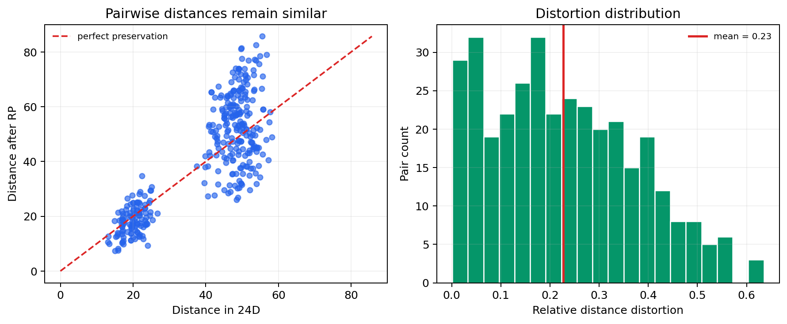

---

## Gaussian or sparse RP?

| Gaussian Random Projection | Sparse Random Projection |
|---|---|
| Dense random matrix | Mostly zero-valued matrix |
| Strong general-purpose baseline | Efficient for sparse inputs |
| Higher memory use | Lower memory use |
| `GaussianRandomProjection` | `SparseRandomProjection` |

---

## RP workshop

**Dataset:** Digits

- Compare PCA, Gaussian RP, and Sparse RP
- Track training / transform runtime
- Record memory use when possible
- Fit the same classifier after each transformation
- Discuss accuracy-speed trade-offs

[](https://colab.research.google.com/github/toche7/SlideDataSci/blob/main/Random_Projection.ipynb)

---

<!-- _class: divider -->

## 05
## UMAP

Reveal neighborhood structure in two dimensions

---

## What UMAP preserves

UMAP is a non-linear method that builds a neighborhood graph, then optimizes a low-dimensional layout.

- Preserves local neighborhoods particularly well
- Can reveal curved or manifold-like structure
- Scales well to many observations
- Can transform new data after fitting

---

## PCA versus UMAP on the same data

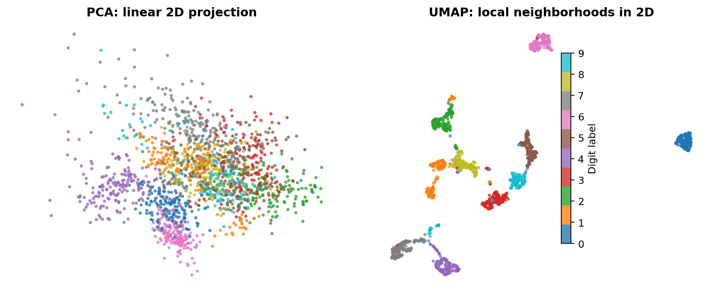

> UMAP can reveal local non-linear structure that a linear 2D projection may overlap.

---

## From neighbors to a graph

UMAP first finds the $k$ nearest neighbors of each observation in the original space.

For neighbor $j$ of point $i$, it assigns a membership strength:

$$
w_{ij} = \exp\left(-\frac{\max(0, d(x_i, x_j) - \rho_i)}{\sigma_i}\right)
$$

- $\rho_i$ adjusts for the local distance to the nearest neighbor
- $\sigma_i$ adapts to the density around point $i$
- Directed neighbor graphs are combined into one fuzzy weighted graph

---

## UMAP starts with neighborhoods

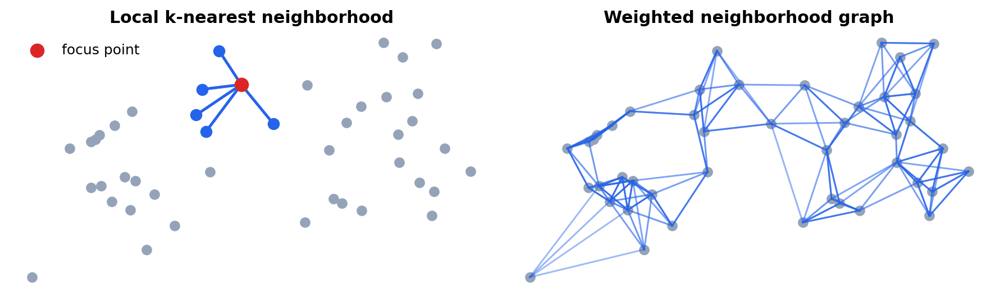

---

## Fuzzy-set objective

In the embedding, UMAP gives nearby points a high-dimensional membership $w_{ij}$ and a low-dimensional membership $v_{ij}$.

$$
v_{ij} = \frac{1}{1 + a\lVert y_i - y_j \rVert^{2b}}
$$

It minimizes a cross-entropy-like objective:

$$
\mathcal{L} = -\sum_{i,j}\left[w_{ij}\log v_{ij} + (1-w_{ij})\log(1-v_{ij})\right]
$$

- Strong graph edges attract points together
- Non-neighbor pairs are pushed apart through negative sampling

---

## What the parameters control

| Parameter | Mathematical role | Visual consequence |
|---|---|---|
| `n_neighbors` | Size of local graph neighborhood | Small: local detail; large: broader structure |
| `min_dist` | Minimum separation in the embedding | Small: tighter clusters; large: more spread |
| `metric` | Distance used to form graph edges | Changes which points count as neighbors |
| `random_state` | Optimization initialization / sampling | Enables reproducible comparisons |

> Change one parameter at a time, then compare whether the same local relationships remain stable.

---

## Effect of n_neighbors

<div class="columns">
<div>

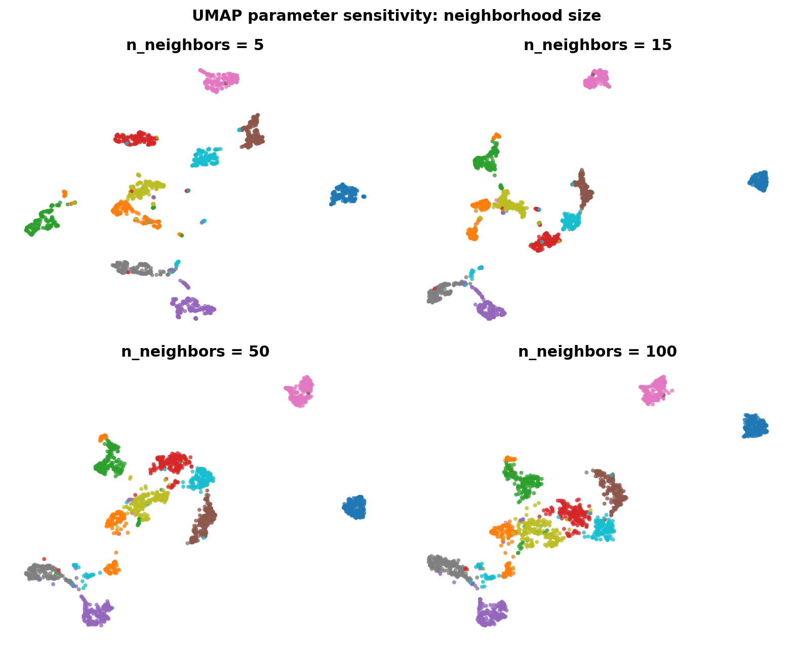

</div>
<div>

- Small values of `n_neighbors` emphasize very local relationships
- Large values incorporate more of the broader neighborhood structure
</div>
</div>

---

## UMAP parameters

| Parameter | Effect |
|---|---|
| `n_neighbors` | Balance local versus broader structure |
| `min_dist` | How tightly points can pack together |
| `n_components` | Output dimensions, often 2 for plots |
| `metric` | How distances are measured in input space |
| `random_state` | Reproducible result for teaching and comparison |

---

## Effect of min_dist

<div class="columns">
<div>

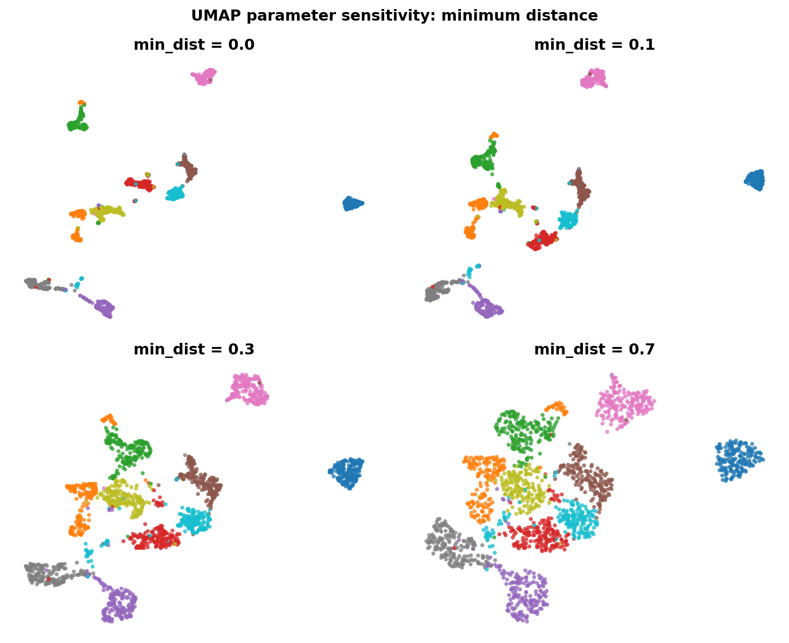

</div>
<div>

- Small `min_dist` permits compact-looking groups
- It changes visual spacing; it does not prove stronger class separation

</div>
</div>

---

## PCA, UMAP, and t-SNE

| Method | Best use | Caution |
|---|---|---|
| PCA | Fast linear preprocessing | May miss non-linear structure |
| UMAP | Exploration and embedding | Parameters change the picture |
| t-SNE | Local visual clusters | Slow; global distances mislead |

> A visualization is a hypothesis-generating tool, not proof of cluster membership.
> t-SNE is a special case of UMAP with a different graph construction and optimization. it is slower and less scalable, but can be useful for small datasets.

---

## Evaluate neighborhood preservation

<center>

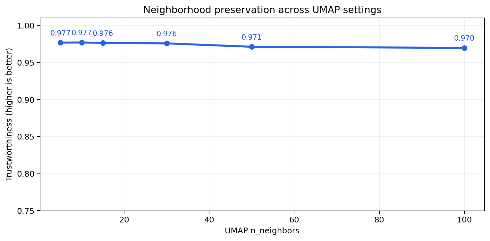

</center>

- Trustworthiness asks whether neighbors in the 2D embedding were also close in the original space
- Values near 1 indicate stronger local-neighborhood preservation
- Use this alongside stability checks and the downstream task metric

---

## UMAP workshop

Use the same standardized dataset for PCA and UMAP.

1. Create 2D PCA and UMAP projections
2. Color by known labels when available
3. Vary `n_neighbors` and `min_dist`
4. Compare cluster separation and local patterns
5. Record runtime and observations

[](https://colab.research.google.com/github/toche7/SlideDataSci/blob/main/UMAP.ipynb)

---

<!-- _class: divider -->

## 06
## Choosing a Method

Match the technique to the decision you need to make

---

## Decision guide

| Method | Supervised | Linear | Primary purpose | Best fit |
|---|---:|---:|---|---|
| PCA | No | Yes | Feature extraction | General ML preprocessing |
| LDA | Yes | Yes | Class separation | Classification |
| Random Projection | No | Random | Fast compression | Big or sparse data |
| UMAP | No | No | Visualization / embedding | Data exploration |

---

## Evaluation checklist

Do not judge a method only by an attractive scatter plot.

- Define the downstream task: visualize, classify, compress, or retrieve
- Prevent data leakage with pipelines and train/test separation
- Compare runtime, memory, and predictive performance
- Check stability across seeds and parameter settings
- Preserve domain interpretability where it matters

---

## Final hands-on challenge (Assignment)

Choose a real-world dataset and present your findings.

1. Preprocess and standardize the data
2. Apply PCA, LDA when labels exist, RP, and UMAP
3. Compare metrics, runtime, and visual patterns
4. Interpret the representations and limitations
5. Recommend one method for the stated objective

**Examples**: MNIST, Fashion-MNIST, CIFAR-10, 20 Newsgroups, or your own dataset

Where to get datasets:  [https://www.kaggle.com/datasets](https://www.kaggle.com/datasets), or [https://archive.ics.uci.edu/ml/index.php](https://archive.ics.uci.edu/ml/index.php)

---

## Key takeaways

- High dimensionality makes density, distance, and visualization difficult
- PCA preserves variance; LDA separates labeled classes
- Random Projection trades some precision for exceptional speed
- UMAP is powerful for exploration, but requires careful interpretation
- The best method depends on the task and evaluation evidence

---

<!-- _class: lead -->

# Questions & Discussion

<div class="subtitle">Which representation best serves your next machine learning task?</div>

**DS08 | Dimensionality Reduction & Visualization**